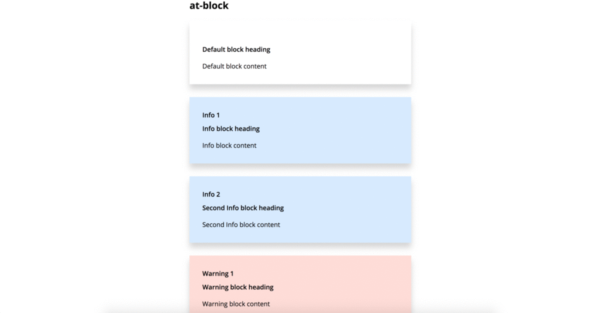

# at-article
[](https://github.com/michaelravedoni/at-article/blob/master/LICENSE)
[](https://www.npmjs.com/package/at-article)

`at-article` is a Web Component collection using [Stencil](https://github.com/ionic-team/stencil) for writing blogs and academics web articles.

 "at-article preview animation"

## Features

- 12 web-components for web native article writing
- usable in any web environment
- clean and flat design

Demo :

- [academic article](https://michaelravedoni.github.io/at-article/demo-academic.html)
- [blog article](https://michaelravedoni.github.io/at-article/demo-blog.html)

## Install

Use one of this solution to "install" the `at-article` component in your project.

### Script tag

- Put a script tag similar to this `<script src='https://unpkg.com/at-article@latest/dist/at-article.js'></script>` in the head of your index.html
- Then you can use the element anywhere in your template, JSX, html, etc.

### Node Modules
- Run `npm install at-article --save`
- Put a script tag similar to this `<script src='node_modules/at-article/dist/at-article.js'></script>` in the head of your index.html
- Then you can use the element anywhere in your template, JSX, html, etc.

### In a stencil-starter app
- Run `npm install at-article --save`
- Add an import to the npm packages `import my-component;`
- Then you can use the element anywhere in your template, JSX, html, etc.

## Usage

Check the documentation for more informations : [Documentation](https://michaelravedoni.github.io/documentation)

**Example with the `at-block` component**

The block element allows to highlight content with a contrasted graphic aspect with the rest of the article.

```html
<at-block caption="true" heading="Heading example" type="info">Lorem ispum</at-block>
```

Property | Default | Explanations
--- | --- | ---
caption | `false` | If `true`, display a numbered caption
heading  |   |  Display a heading
type  | `default` |  The values can be `default`, `info`, `example`, `warning`, `definition` or `fact`


## Build with
![Built With Stencil](https://img.shields.io/badge/-Built%20With%20Stencil-16161d.svg?logo=data%3Aimage%2Fsvg%2Bxml%3Bbase64%2CPD94bWwgdmVyc2lvbj0iMS4wIiBlbmNvZGluZz0idXRmLTgiPz4KPCEtLSBHZW5lcmF0b3I6IEFkb2JlIElsbHVzdHJhdG9yIDE5LjIuMSwgU1ZHIEV4cG9ydCBQbHVnLUluIC4gU1ZHIFZlcnNpb246IDYuMDAgQnVpbGQgMCkgIC0tPgo8c3ZnIHZlcnNpb249IjEuMSIgaWQ9IkxheWVyXzEiIHhtbG5zPSJodHRwOi8vd3d3LnczLm9yZy8yMDAwL3N2ZyIgeG1sbnM6eGxpbms9Imh0dHA6Ly93d3cudzMub3JnLzE5OTkveGxpbmsiIHg9IjBweCIgeT0iMHB4IgoJIHZpZXdCb3g9IjAgMCA1MTIgNTEyIiBzdHlsZT0iZW5hYmxlLWJhY2tncm91bmQ6bmV3IDAgMCA1MTIgNTEyOyIgeG1sOnNwYWNlPSJwcmVzZXJ2ZSI%2BCjxzdHlsZSB0eXBlPSJ0ZXh0L2NzcyI%2BCgkuc3Qwe2ZpbGw6I0ZGRkZGRjt9Cjwvc3R5bGU%2BCjxwYXRoIGNsYXNzPSJzdDAiIGQ9Ik00MjQuNywzNzMuOWMwLDM3LjYtNTUuMSw2OC42LTkyLjcsNjguNkgxODAuNGMtMzcuOSwwLTkyLjctMzAuNy05Mi43LTY4LjZ2LTMuNmgzMzYuOVYzNzMuOXoiLz4KPHBhdGggY2xhc3M9InN0MCIgZD0iTTQyNC43LDI5Mi4xSDE4MC40Yy0zNy42LDAtOTIuNy0zMS05Mi43LTY4LjZ2LTMuNkgzMzJjMzcuNiwwLDkyLjcsMzEsOTIuNyw2OC42VjI5Mi4xeiIvPgo8cGF0aCBjbGFzcz0ic3QwIiBkPSJNNDI0LjcsMTQxLjdIODcuN3YtMy42YzAtMzcuNiw1NC44LTY4LjYsOTIuNy02OC42SDMzMmMzNy45LDAsOTIuNywzMC43LDkyLjcsNjguNlYxNDEuN3oiLz4KPC9zdmc%2BCg%3D%3D&colorA=16161d&style=flat-square)

- [Stencil](https://github.com/ionic-team/stencil) is a compiler for building fast web apps using Web Components.

## Building

```bash
git clone https://github.com/ionic-team/stencil-component-starter.git my-component
cd my-component
git remote rm origin
```

and run:

```bash
npm install
npm start
```

To watch for file changes during develop, run:

```bash
npm run dev
```

To build the component for production, run:

```bash
npm run build
```

To run the unit tests for the components, run:

```bash
npm test
```

Need help? Check out our docs [here](https://stenciljs.com/docs/my-first-component).

## Contributing

We’re really happy to accept contributions from the community, that’s the main reason why we open-sourced it! There are many ways to contribute, even if you’re not a technical person.

1. Fork it (<https://github.com/michaelravedoni/at-article/fork>)
2. Create your feature branch (`git checkout -b feature/fooBar`)
3. Commit your changes (`git commit -am 'Add some fooBar'`)
4. Push to the branch (`git push origin feature/fooBar`)
5. Create a new Pull Request

## Release History

## v0.0.3
* Components <at-abstract> and <at-summary> added

## v0.0.2
* Hosted documentation
* es5 polyfill

## v0.0.1
* Initial release

## Roadmap

- `citeproc-js` implementation
- themes implementation

## Authors and acknowledgment

* **Michael Ravedoni** - *Initial work* - [michaelravedoni](https://github.com/michaelravedoni)

See also the list of [contributors](https://github.com/michaelravedoni/at-article/contributors) who participated in this project.

## License

[MIT License](https://opensource.org/licenses/MIT)
